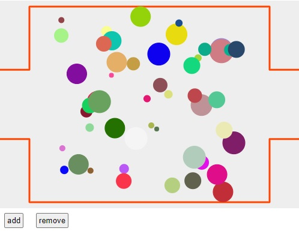

# CIRCLES ON CANVAS / VISITORS IN A MUSEUM

The goal of this project is to have a analogy of visitors in a room
The circles represent people in a museum. Every time a new person enters,
a new circle appears on the canvas. When a person leaves, the point will
be removed from the canvas. In order for this to work automaticaly, the buttons
for adding and removing circles must be replaced by a service which dispaches events to the app.
The circles have a random speed, direction and color.



## Getting started

Get a local copy of the project

```
git clone https://github.com/hkfrei/movincircles.git
```

Enter the newly created directory.

```
cd  movingcircles
```

Install dependencies

```
npm install
```

## Available Scripts

In the project directory, you can run:

### `npm start`

Runs the app in the development mode.<br>
Open [http://localhost:8080](http://localhost:8080) to view it in the browser.

The page will reload if you make edits.<br>

### `npm build`

Builds the app for production to the `build` folder.<br>
It bundles and minifys the code in order for the app to be deployed.

## Ideas for further development

- Implement collition detection between circles.
